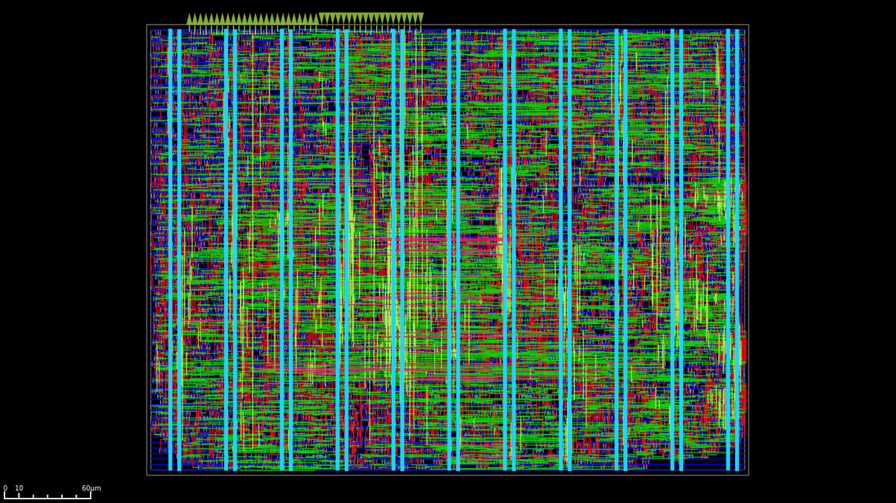

# Systollic Array with DFT and Floating Point math v2 


This project is the second iteration of the systollic array ASIC featuring a more 
complete DFT infrastructure and floating point arithmetics. 

It targets the IHP 130 nm `sg13g2`open PDK, has a maximum operating frequency of 100MHz and is taped out as part of the Tiny Tapeout [ihp26a shuttle](https://tinytapeout.com/).

**Documentation on using this accelerator can be found : [here](docs/info.md)**

 

## ASIC 

This accelerator was designed for the IHP 130nm node using the sg13g2 PDK. It occupies 126,685 µm² of die area and has a target typical operating voltage of 1.2V at 25°C.

This design features two clock trees, one for the MAC and another for the JTAG TAP. The MAC clock targets a 100 MHz maximum operating frequency, but current output GPIO 
frequency experiements suggest a 75 MHz maximum, and the JTAG 2 MHz.

There are currently no known manufacturability issues.

Current status: Taped-in, in fabrication, part of the Tiny Tapeout [ihp26a shuttle](https://tinytapeout.com/). \
Chip expected: 2026-07-31


## Floating point math 

This design will be including a from scratch custom implementation of the 
bfloat16 artithemtic optimized for performance and area. 

This implementation leverages the fact there is no official standard outlining the 
behavior of `bfloat16` to implement only the subset of floating point behavior 
that I judge to be neccessary for our workload in favor of higher performance at 
a low area budget. 

These choices are : 
- round toward zero rounding only
- no subnormal support, all subnormals will be clamped to 0
- no $\pm \infty$ or `NaN` support

For more information refer to the [bfloat repository](https://github.com/Essenceia/BFloat16)

# DFT 

This design embeds a JTAG for debugging the accelerator's usage by probing into internal registers.
This can be used to helping identify PCB issues using a boundary scan, and probing the internal systolic 
array registers connected to an internal scan chain.

This JTAG TAP was designed to operate at `2 MHz`, has idcode `0x2beef0d7`.

Its instruction register length is `3`, and implements the following instructions:

| Instruction | Opcode | Description |
|---|---|---|
| `EXTEST` | `0x0` | Boundary scan |
| `IDCODE` | `0x1` | Reads JTAG TAP identifier |
| `SAMPLE_PRELOAD` | `0x2` | Boundary scan |
| `USER_REG` | `0x3` | Probe internal registers |
| `SCAN_CHAIN` | `0x4` | Internal logic scan chain |
| `BYPASS` | `0x7` | Set the TAP in bypass mode |

All four standard instructions `EXTEST`, `IDCODE`, `SAMPLE_PRELOAD`, `BYPASS` conform to the standard behavior.

`SCAN_CHAIN` is a private JTAG instruction used for observing the systolic array's flops state. The order of the flop chain can be found at the end of the [`.def` file](../final/tt_um_essen.def) in the definition of the `chain_0` scan chain.

## Quickstart

For quickly getting started, use the utilities provided in `jtag/openocd.cfg`.

Given this default config assumes you are using a `jlink`, and this might not be the adapter you are using, you may need to update the adapter by including your probe's config file:
```
source [find interface/jlink.cfg]
```

### Usage 

Run using : 
```
openocd -f jtag/openocd.cfg
```

Expected output:
```
Open On-Chip Debugger 0.12.0+dev-02429-ge4c49d860 (2026-03-17-19:44)
Licensed under GNU GPL v2
For bug reports, read
	http://openocd.org/doc/doxygen/bugs.html
Info : J-Link V10 compiled Jan 30 2023 11:28:07
Info : Hardware version: 10.10
Info : VTarget = 3.348 V
Info : clock speed 2000 kHz
Info : JTAG tap: tpu.tap tap/device found: 0x2beef0d7 (mfg: 0x06b (Transwitch), part: 0xbeef, ver: 0x2)
Warn : gdb services need one or more targets defined
idcode : 2beef0d7
read internal register 0:0 : 0x0000 - weight
read internal register 0:1 : 0x0000 - multiplicand ( input data )
read internal register 0:2 : 0x0000 - summand ( input data )
read internal register 0:3 : 0x0000 - multiplication result (internal computation)
read internal register 1:0 : 0x0000 - weight
read internal register 1:1 : 0x0000 - multiplicand ( input data )
read internal register 1:2 : 0x0000 - summand ( input data )
read internal register 1:3 : 0x0000 - multiplication result (internal computation)
read internal register 2:0 : 0x0000 - weight
read internal register 2:1 : 0x0000 - multiplicand ( input data )
read internal register 2:2 : 0x0000 - summand ( input data )
read internal register 2:3 : 0x0000 - multiplication result (internal computation)
read internal register 3:0 : 0x0000 - weight
read internal register 3:1 : 0x0000 - multiplicand ( input data )
read internal register 3:2 : 0x0000 - summand ( input data )
read internal register 3:3 : 0x0000 - multiplication result (internal computation)
Info : Listening on port 6666 for tcl connections
Info : Listening on port 4444 for telnet connections
...
```

## Improvements on v1 

[Link to v1, tapedout on GlobalFoundary 180nm, part of Tiny Tapeout experimental shuttle `gf0p2`](https://github.com/Essenceia/Systolic_MAC_with_DFT)

- signed intergers upgraded to floating point math using `bfloat16`
- systollic array flops part of scan chain for debugging, hocked up to JTAG, accessible though private JTAG instruction (documented in [datasheet](docs/info.md))
- higher clock frequency: max 100MHz target

## Dependancies

In order to add the DFT scan chain this project rellies on a custom version of librelane 
found [here](https://github.com/Essenceia/librelane) on branch `dft_scan_chain`. 

Then, since the scan chain is hooking up to an internal component and not top level I/O pins
and there was a small bug in the syntax of the output def file format produced by openROAD 
we must also run a different openROAD version than the default version used by librelane `3.0.0rc0`. 
Yet, because of a breaking change in openSTA, I have backported this def writer fix to a 
older version of openROAD. 
So now we have both a custom librelane and openROAD version. 

This custom openROAD can be found [here](https://github.com/Essenceia/OpenROAD) on branch `librelane_300rc0` and will be 
automatically used instead of the default version on nix shells. 

## License

This project is licensed under the Apache License 2.0, see the [LICENSE](LICENSE) file for details.

# Credits 

Thanks to the Tiny Tapeout project, its contributors, the OpenROAD maintainers for there fast response to the internal scan chain def file bug, and all the community working on open source silicon tools for making this possible.

