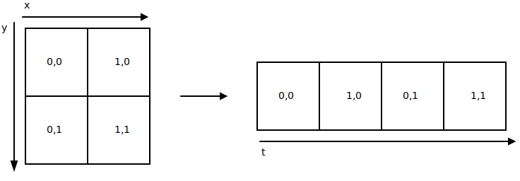
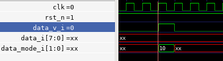

<!---

This file is used to generate your project datasheet. Please fill in the information below and delete any unused
sections.

You can also include images in this folder and reference them in the markdown. Each image must be less than
512 kb in size, and the combined size of all images must be less than 1 MB.
-->
# Multiply and accumulate matrix multiplier ASIC with design for test infrastructure

ASIC design for a 2x2 systolic matrix multiplier supporting multiply and accumulate
operations on int8 data alongside a design for test infrastructure to help debug
both usage and diagnose design issues in silicon.

# Pinout 

This accelerator uses the following pinout:

| ui (Inputs)       | uo (Outputs)     | uio (Bidirectional)      |
| ----------------- | ---------------- | ------------------------ |
| ui[0] = tck       | uo[0] = result_o | uio[0] = data_i[7]       |
| ui[1] = data_i[0] | uo[1] = result_o | uio[1] = data_valid_i    |
| ui[2] = data_i[1] | uo[2] = result_o | uio[2] = data_mode_i     |
| ui[3] = data_i[2] | uo[3] = result_o | uio[3] = data_rst_addr_i |
| ui[4] = data_i[3] | uo[4] = result_o | uio[4] = tdi             |
| ui[5] = data_i[4] | uo[5] = result_o | uio[5] = tms             |
| ui[6] = data_i[5] | uo[6] = result_o | uio[6] = tdo             |
| ui[7] = data_i[6] | uo[7] = result_o | uio[7] = result_v_o      |
 
 

# MAC 

This MAC accelerator operates at up to 50MHz and is capable of reaching up to 100 MMAC/s or 200 MIOPS/s. 

## Background 

The goal of the MAC accelerator is to perform a matrix matrix multiplication between the input data
matrix $I$ and the weight matrix $W$. 
```math
\begin{gather}
I \times W = R \\
\begin{pmatrix} 
i_{0,0} & i_{1,0} \\
 i_{0,1} & i_{1,1} 
\end{pmatrix} 

\times 

\begin{pmatrix} 
w_{0,0} & w_{1,0} \\ 
w_{0,1} & w_{1,1} 
\end{pmatrix} = 

\begin{pmatrix} 
i_{0,0}w_{0,0}+i_{1,0}w_{0,1} & i_{0,0}w_{1,0}+i_{1,0}w_{1,1}\\ 
i_{0,1}w_{0,0}+i_{1,1}w_{0,1} & i_{0,1}w_{1,0}+i_{1,1}w_{1,1}\end{pmatrix}

=

\begin{pmatrix} 
r_{0,0} & r_{1,0} \\ 
r_{0,1} & r_{1,1} 
\end{pmatrix}
\end{gather}

```
This MAC accelerator has 4 units and from this point on, we will refer to each MAC unit according to their unique $(x,y)$ coordinates. 

Each MAC unit calculates the MAC operation $c_{(t,x,y)}$, where :
- $w_{(x,y)}$ is the fixed weight configured for this unit; this value is fixed throughout a set of $I$ and $W$ input matrices.
- $i_{(t,y)}$ is a value from the $y$ row of the $I$ matrix that is circulated per timestep $t$ through a row of the matrix.
- $c_{(t-1,x,y-1)}$ is the result at the previous timestep $t-1$ of the MAC unit above this MAC unit, circulated downwards per column.
```math
c_{(t,x,y)} = i_{(t,y)} \times w_{(x,y)} + c_{(t-1,x,y-1)}
```

Given this accelerator was designed to operate on signed 8-bit integers, 
but that the successive application of the 8-bit multiplication and addition 
pushes the resulting value up to 17 bits, in order to prevent the size of the base datatype 
from increasing with each successive MAC operation, we need to clamp it down back within the 8-bit range.

As such, the MAC unit performs an additional clamping function $clamp_{i8}$ that remaps :
```math
clamp_{i8}(c_{(t,x,y)}) = \begin{cases}
   127 &\text{if } c_{(t,x,y}) > 127\\
   c_{(t,x,y)} &\text{if } c_{(t,x,y)} \in [-128,127] \\
    -128 &\text{if } c_{(t,x,y}) < -128\\
\end{cases}
```

Our final full MAC operation is as follows : 
```math
c_{(t,x,y)} = clamp_{i8}(i_{(t,y)} \times w_{(x,y)} + c_{(t-1,x,y-1)})
```

At each MAC timestep $t+1$ :
- the result of a MAC unit $c_{(t,x,y)}$ is shifted downwards on the same column and becomes the input of the MAC unit $(x,y+1)$ below.
- $i_{(t,x)}$ is shifted rightwards and used as input to MAC unit $(x+1,y)$. 

This data streaming allows such designs to make more efficient use of data, re-using it multiple times as the data circulates through the array, contributing to the final results without spending time on expensive data accesses, allowing us to dedicate more of our silicon area and cycles to compute.

## Throughput

Assuming a pre-configured $W$ weight matrix is being reused and the accelerator is receiving a gapless stream of multiple $I$ input matrices, this MAC accelerator is capable of computing up to 100 MMAC/s or 200 MIOPS/s.

### IO Bottleneck

Accelerator operations are stalled if a MAC operation has a data dependency on data that has yet to arrive. For example, calculating $r_{(0,0)}$ depends on both $i_{(0,0)}$​ and $i_{(1,0)}$​.
In practice, each operation depends on two pieces of input data, yet our input interface being only 8 bits wide allows us to transfer only a single $i_{(x,y)}$​ per cycle.

This limitation means our accelerator is actually operating at half maximum capacity due to this IO bottleneck. If the IO interface were either (a) at least 16 bits wide, or (b) 8 bits wide but operating at 100 MHz, resolving this bottleneck, our maximum throughput would be 200 MMAC/s or 400 MIOPS/s.

## Usage 

The typical sequence to offload matrix operations to the accelerator would go as follows:
1. Reset the accelerator (necessary on init)
2. Configure the weights $W$ (can be re-used once configured)
3. Send the input data $I$
4. Read the result $R$

This design doesn't feature on-chip SRAM and has limited on-chip memory.
Given weights have high spatial and temporal locality, this design allows each weight to be configured per MAC unit. This configuration can be reused across multiple matrices.
The input matrix, on the other hand, is expected to be provided on each usage.

Given our input and output data buses are only 8 bits wide, for data transfers to and from the chip the matrices are flattened in the following order:



Notes:
- All references to `cycles` below are clocked according to the `clk` pin.
- Empty cycles, as in one or more cycles where `data_v_i` would go low in the middle of the transfer of both the input matrix and the weights, are supported.
  
### Resetting MAC 

Given we are not sending an index alongside each data transfer to indicate which weight/data coordinates ( index ) each data corresponds to, 
the MAC accelerator keeps track of the next index internally. As such, if due to external reasons a partial transfer occurs, it becomes necessary 
to reset this index using the reset sequence described below. 

The weights streaming indexes and the data streaming indexes can be reset independently, each requires a single data
transfer cycle during which : 
- `data_v_i` is set to `1`
- `data_mode_i` is set to `0` if we are resetting the `weights` indexes, `1` to reset the data indexes
- `data_i[7:0]` is ignored
- `data_rst_addr_i` is set to `1`

#### Example

In this example we are resetting both the data streaming index and the weight index back to back. 



### Configure weights

Configuring the weights takes 4 data transfer cycles, during which : 
- `data_v_i` is set to `1`
- `data_mode_i` is set to `0` indicating we are sending `weights`
- `data_i[7:0]` contains the weights
- `data_rst_addr_i` is set to `0`

#### Example 

In this example we are configuring the weight matrix $W$ to : 
```math
W = 
\begin{pmatrix} 
0 & 1 \\ 
2 & 3 
\end{pmatrix} 
```


#### Debug

The implemented JTAG TAP can be used to easily debug the weight matrix configuration sequence as it allows the user using the `USER_REG` instruction to 
read the currently configured weights for each MAC unit. 

In the existing openocd helper scripts located at `jtag/openocd.cfg` the `read_user_reg` can be used to read the weights using openocd when used as follows : 
```tcl
set r 0
for {set u 0} {$u <= $USER_REG_UNIT_MAX} {incr u} {
    puts "read internal register $u : 0x[read_user_reg $_CHIPNAME $u $r] - [print_reg_id $r]"  
}
```

For the $W$ weight matrix configured in the example above, the expected output should be : 
```
read internal register 0 : 0x00 - weight
read internal register 1 : 0x01 - weight
read internal register 2 : 0x02 - weight
read internal register 3 : 0x03 - weight
```

### Sending the input matrix

Sending the input matrix takes 4 data transfer cycles, during which : 
- `data_v_i` is set to `1`
- `data_mode_i` is set to `1` indicating we are sending the input matrix
- `data_i[7:0]` contains the input data
- `data_rst_addr_i` is set to `0`

#### Example

In this example we are sending the input data matrix $I$ : 
```math
I = 
\begin{pmatrix} 
4 & 5 \\ 
6 & 7 
\end{pmatrix} 
```


### Receiving result

When receiving a result the asic will drive the following pins during 
4 data transfer cycles : 
- `res_v_o` is set to `1`
- `res_o[7:0]` contains the result of the MAC operation for a single matrix coordinate

#### Simple example

In this example the $W$ MAC weight matrix is being configured and the $I$ data is being streamed in, following which, the $R$ result starts being sent out. 
```math
R = I \times W = 
\begin{pmatrix} 
4 & 5 \\ 
6 & 7 
\end{pmatrix}
\times
\begin{pmatrix} 
0 & 1 \\ 
2 & 3 
\end{pmatrix}
=
\begin{pmatrix} 
10 & 19 \\ 
14 & 27
\end{pmatrix}
```


#### Complex example 

Internally, the accelerator takes at most 4 cycles to produce a result from incoming data. This accounts for incoming data latching, circulating the data through the entire systolic array, and output streaming. The accelerator moves the incoming data through the array as soon as it is available. Because of this, and since this accelerator supports gaps in the incoming data stream, if, for example, the last data transfer of $i_{(1,1)}$ ​is delayed by at least 2 cycles, then the accelerator result will start streaming out before all of the input matrix has finished streaming in.

This is why, in the firmware (`firmware/main.c`), we set up the DMA stream to receive the data before we start sending the input matrix, as the gap between sending and getting the result is too small for the controlling MCU to perform any type of compute.


# DFT 

This design embeds a JTAG for debugging the accelerator's usage by probing into internal registers and helping identify PCB issues using a boundary scan.

This JTAG TAP was designed to operate at `2 MHz`, has idcode `0x1beef0d7`.

Its instruction register length is `3`, and implements the following instructions:

| Instruction | Opcode | Description |
|---|---|---|
| `EXTEST` | `0x0` | Boundary scan |
| `IDCODE` | `0x1` | Reads JTAG TAP identifier |
| `SAMPLE_PRELOAD` | `0x2` | Boundary scan |
| `USER_REG` | `0x3` | Probe internal registers |
| `BYPASS` | `0x7` | Set the TAP in bypass mode |

All four standard instructions `EXTEST`, `IDCODE`, `SAMPLE_PRELOAD`, `BYPASS` conform to the standard behavior.

## `USER_REG`

The `USER_REG` state was designed to probe into the data currently used by each of the 4 MAC units.
The data to be read is specified by loading its address in the data register during a previous `DR_SHIFT` stage. As such, two sequences of `DR_SHIFTS` might be necessary:
1. Load the address of the next data
2. Read the data off TDI

The address and data are both `8` bits wide, though only the bottom 4 bits of the address are used.

### Address format
The address uses the following format:
```
[ unused 7:4 ][ mac unit 3:2 ][ register id 1:0 ] 
```
Register id mapping for this MAC unit gives us the current:

| Register ID | Description |
|---|---|
| `0x0` | Weight (multiplier) |
| `0x1` | Multiplicand (circulated data) |
| `0x2` | Summand (circulated data) |
| `0x3` | MAC operation overflow bits, used in rounding to the maximum representation range of the `int8_t`, discarded before the next MAC unit (internal MAC unit data) |

## Important considerations for usage 

When using the USER_REG custom JTAG TAP instruction, the MAC logic is expected to be temporarily halted, as in no weight or data update operations and no matrix compute is expected to be ongoing.
To this effect, there is no CDC protection when transferring data between the JTAG clock domain and the MAC domain. If the MAC isn't halted, the resulting metastability risks corrupting the sampled data.

This also applies when doing a boundary scan.

## Quickstart

For quickly getting started, use the utilities provided in `jtag/openocd.cfg`.

Given this default config assumes you are using a `jlink`, and this might not be the adapter you are using, you may need to update the adapter sourcing your current probe:
```
source [find interface/jlink.cfg]
```

### Usage 
Run using : 
```
openocd -f jtag/openocd.cfg
```

Expected output:
```
Open On-Chip Debugger 0.12.0+dev-02171-g11dc2a288 (2025-11-23-19:25)
Licensed under GNU GPL v2
For bug reports, read
	http://openocd.org/doc/doxygen/bugs.html
Info : J-Link V10 compiled Jan 30 2023 11:28:07
Info : Hardware version: 10.10
Info : VTarget = 3.380 V
Info : clock speed 2000 kHz
Info : JTAG tap: tpu.tap tap/device found: 0x1beef0d7 (mfg: 0x06b (Transwitch), part: 0xbeef, ver: 0x1)
Warn : gdb services need one or more targets defined
idcode : 1beef0d7
read internal register 0:0 : 0x00 - weight
read internal register 0:1 : 0x00 - multiplicand ( input data )
read internal register 0:2 : 0x00 - summand ( input data )
...
```
